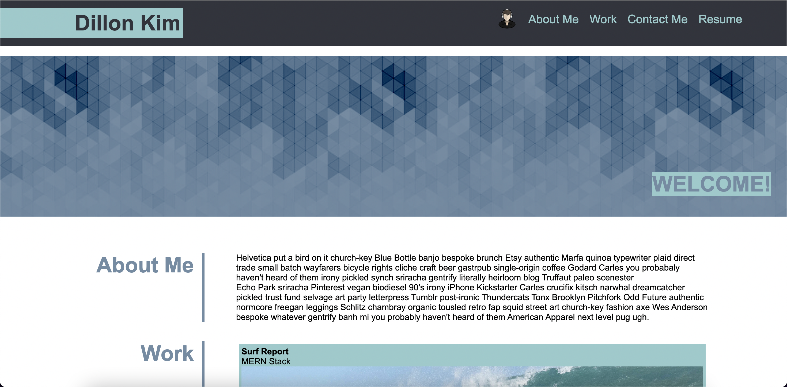
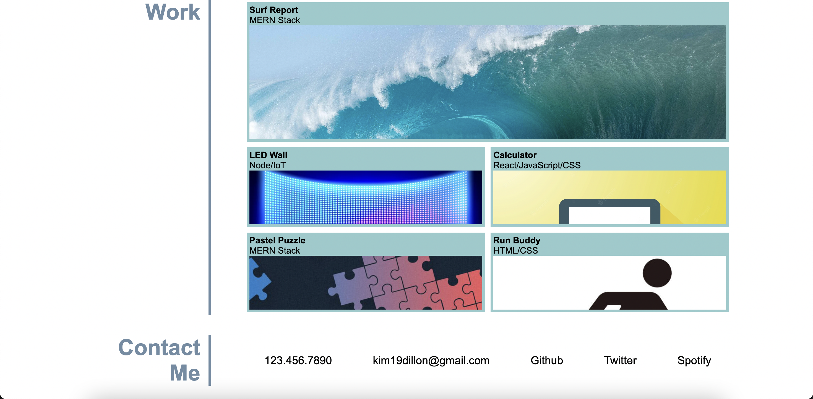

CONTENTS OF THIS FILE
---------------------
  * Description
  * Screenshots
  * Deployed Links
  
DESCRIPTION
-----------
As I learn about web developing, it is important to create a website that introduces what kinds of projects that I have completed and what applications I will soon be able to make. 

This website showcases various html and css skills I have learned with the curriculum. Some things I have learned are the concepts of flex, media queries, and further organizing content with css. 

SCREENSHOTS
-----------
The following image shows the web application's appearance:

DEPLOYED LINKS
--------------

#### Dillon Kim Portfolio
* https://dillonkim19.github.io/challenge02

#### Github
* https://github.com/dillonkim19/challenge02